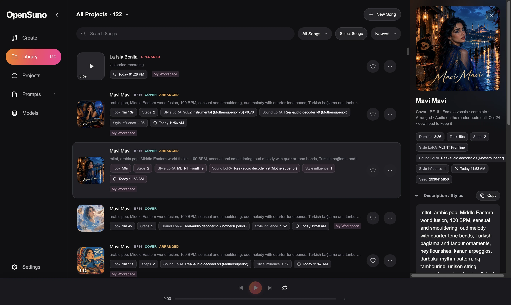
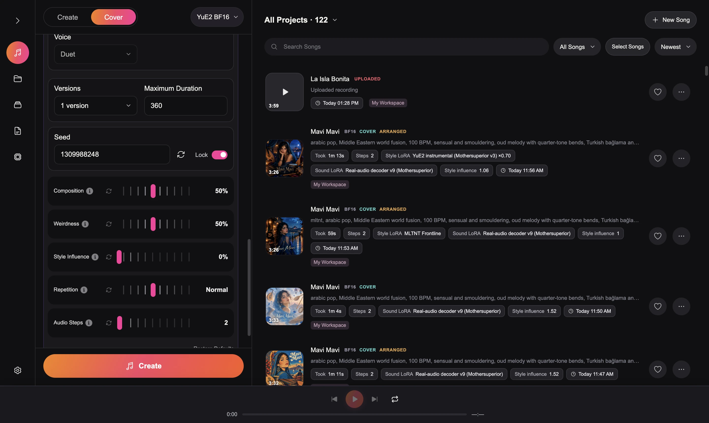

# OpenSuno-YuE2

> *Suno liber in aeternum*: sound, free forever. The name echoes the Latin *sonō*, "I sound".

Local music generation with a browser interface for the [YuE2](https://huggingface.co/m-a-p/YuE2-3B) model on Apple Silicon and Windows/NVIDIA:
lyrics and style prompts, instrumental mode, covers of uploaded recordings, song editing and
extension, community LoRAs, a library with projects, and an optional render node on another
machine.





- [opensuno.org](https://opensuno.org): project website.
- [START-HERE.md](START-HERE.md): how to use the page and what each control does.
- [FEATURES.md](FEATURES.md): every feature, how it works and what it improves.
- [MODELS.md](MODELS.md): which models to download, how (from the page or by hand) and how to use
  LoRAs.

## Features

Details for each are in [FEATURES.md](FEATURES.md).

**Create songs**

- Songs from lyrics and a style line, with a plan mode: *Melody and Chords* (the model writes a
  chord-annotated score first), *Melody Only* or *No Plan*.
- **Instrumental** mode that is actually instrumental: the sung melody moves to an instrument and
  the section tags still shape the song.
- **Voice**: Any, Male, Female or Duet.
- Musically named controls: **Composition**, **Weirdness**, **Style Influence**, **Repetition** and
  **Audio Steps**, plus a maximum duration, up to 8 versions per run and a lockable seed.
- **Add Style**: 73 style presets (from SongScribe) with blending, era, texture and mood modifiers,
  and a builder for genre, voice, instruments, mood, tempo and production.
- **Ask AI** writes a style line from a short description (OpenAI, optional).
- **Lyrics helpers**: **Add Tag** inserts `[Verse]`, `[Chorus]` and other section tags; a
  structure check fixes malformed tags in one click and warns when the lyrics won't fit the
  duration; **Find lyrics** searches LRCLIB by title and artist.
- **Album art** for every song (OpenAI, optional).

**Cover / Remix an uploaded recording**

- Upload WAV, MP3, FLAC, M4A, AIFF, OGG or AAC (up to 200 MB / 30 minutes) and trim it on a waveform.
- The melody (or melody and chords) is transcribed with SheetSage2 and MERT-v2. The analysis is
  cached, so it runs once per clip.
- **Arrange with the Model** keeps the melody and heard instrumental lines, and writes in-tune chords
  on every bar plus its own lines in the new style.
- **Vocal Range** moves the melody to where the chosen voice sings it.
- **Continue this recording** keeps the audio up to a point and writes what follows (Audio input
  package).
- Title and lyrics are prefilled from tags embedded in the file. Every upload is kept in the library,
  badged **UPLOADED**.

**Work with finished songs**

- **Extend** a song, or **Regenerate from here** at a chosen bar, on a timeline with bar snapping.
- **Edit** the arrangement at the score level: style, tempo, harmony (keep chords, new chords, jazz
  sevenths) and structure (move, repeat, remove or shorten sections).
- **Re-render** from the saved music tokens with more audio steps or a different sound LoRA, which
  makes a fair A/B test.
- **Adjust Speed** with or without keeping the pitch.
- **Use these settings** restores any version exactly, seed included.

**LoRA adapters**

- Two slots: **Writes** (style, genre and artist adapters) and **Renders** (sound-only adapters, such
  as the Real-audio decoder v9). They stack.
- A catalog of community LoRAs downloads from **Models → LoRAs**. Choosing one fills in its trigger
  word and recommended settings.
- Any YuE2 LoRA in Hugging Face, PEFT, ComfyUI or Sound & Vision layout can be dropped into `loras/`.
- On the Mac, adapters are folded into the weights, so a LoRA costs no speed.

**Library**

- A queue: submit while a song renders and the new one waits its turn.
- Projects (workspaces), favorites, rename, search, filters and bulk select.
- WAV and MP3 downloads.
- Deleted songs go to a trash folder, never erased.
- Prompts can be saved and reused.

**Models and performance**

- One-click model downloads from the **Models** page: resumable, verified with SHA-256, pinned to
  exact Hugging Face revisions. See [MODELS.md](MODELS.md).
- Models stay loaded between songs, so the second song starts in seconds.
- MLX speed-ups on Apple Silicon: a sliced output head, batched classifier-free guidance and fewer
  host syncs.
- Windows / NVIDIA support with the official YuE2 checkpoint (CUDA BF16, experimental FP8).

**Setup and privacy**

- Mac disk-image installer for the Studio, the render node or both, with a menu bar app for the
  node.
- **Render node**: render on another machine's GPU while the Studio runs elsewhere.
- Everything runs locally. The server listens on `127.0.0.1` only, and recordings are never uploaded.
  The only network calls are model downloads, LRCLIB lyric search, and OpenAI when a key is set.

## Hints

### Which models to download

- **Generator:** **YuE2 BF16** on a Mac, **YuE2 CUDA BF16** on Windows / NVIDIA. CUDA FP8 is
  experimental and was slower in testing.
- **Cover analysis** only if you want covers of your own recordings. Add **Audio input** on top only
  for *Continue this recording*.
- **Real-audio decoder v9** under Models → LoRAs is the one LoRA worth having for every song: it gives
  a fuller, more produced sound.

### Recommended selection for a new song

- **Renders:** Real-audio decoder v9 at 100%. It only changes the sound, never what is written, so it
  combines with anything.
- **Writes:** None for a general song. Pick a style LoRA only when you want its genre, and let its
  card fill in the settings. Start the style line with its trigger word (`sv_oldschoolhiphop`,
  `mltnt`, `chnsn`, `qwwl`, `drksf`, `cnzn`).
  - **YuE2 instrumental (Mothersuperior v3):** Instrumental on, Melody and Chords, 70% strength.
    100% tends to repeat patterns.
  - **Old School Hip-Hop:** 100%, No Plan, Style Influence 1.0.
  - **QWWL / DRKSF (qawwali):** always No Plan. Melody and Chords pulls them back to pop.
  - **MLTNT, CHNSN, CNZN:** keep the card's settings (mostly 100%; MLTNT Fusion uses 150%) and
    write lyrics in the pack's language: Jamaican Patois, French or Italian.
- **Plan:** Melody and Chords (the default) gives the most structured songs.
- **Style Influence:** 1.2. Raise it toward 1.5 if the genre, instruments or voice are ignored.
- **Repetition:** set it to *Less* if a song gets stuck in a loop.
- **Audio Steps:** 2 is enough to judge a song. Re-render the ones you like with more steps later.
  That cleans the sound without changing the music.

### Recommended selection for a cover

- **Renders:** Real-audio decoder v9 at 100%.
- **Writes:** None. On a cover a style LoRA's writing half is switched off after the arrangement step,
  so the melody isn't rewritten into a loop. What remains only tints the sound. The instrumental v3
  adapter has no sound half, so it does nothing on a cover.
- **Style** is the main control: write the new genre, instruments, voice and tempo there in plain
  words. Trigger words have no effect on covers.
- Keep **Arrange with the Model** on, set **Preserve** to melody (or melody and chords to keep the
  original harmony), and set **Vocal Range** to *Match the Voice* with the Voice you want.
- Write lyrics with section tags that follow the recording's form. Lyrics are sung as written; they
  are not taken from the audio.
- For a *new* song in a LoRA's genre, use Create instead of Cover.

## Install

Allow at least 20 GB of free disk space for weights and Python environments. Tested on an M4 Pro
with 64 GB and on an RTX 4070 Ti SUPER 16 GB; other hardware has not been benchmarked here.

### Mac: disk image

`OpenSuno.dmg` is one installer for a Mac with nothing else installed (no Homebrew, no Terminal).
Open it and open **Install OpenSuno**. Tick what this Mac should do:

- **Studio**: the interface. It opens in the browser and sends everything heavy to a render node
  (rendering, cover analysis, trimming uploads, and the OpenAI calls for styles and album art; the
  OpenAI key is kept on the node).
- **Render node**: renders songs on this Mac's GPU, with the **OpenSuno Render Node** menu bar app.
  Optionally with **Cover analysis** (the PyTorch environment for turning recordings into covers)
  and **Start at login**.

Both on one Mac is the all-in-one setup. The installer puts the code, a self-contained Python and
ffmpeg into `~/OpenSuno`, downloads the Python packages the chosen parts need (internet required),
installs the apps into /Applications and starts them. Running it again updates in place without
touching songs, settings or models. The installer is not notarized: on the first open go to
**System Settings → Privacy & Security** and click **Open Anyway**.

A Studio on another Mac pairs in **Settings → Rendering** with the node's address and token (both
under the menu bar icon). To build the disk image on a Mac with Xcode:
`Build OpenSuno Installer.command` writes `dist/OpenSuno.dmg`.

### Mac: from source

1. Clone the repository and install [Homebrew](https://brew.sh) if necessary.
2. `bash "Install OpenSuno.command"` installs Python 3.12 and 3.11, FFmpeg and two isolated Python
   environments (MLX for generation, PyTorch for cover analysis). It can be rerun after a failure.
3. Open `Launch Studio.command`. The page at <http://127.0.0.1:7862> lists the model packages under
   **Models**: **BF16** (the generator, about 7.5 GB), **Cover analysis** (SheetSage2 and MERT-v2,
   about 2.8 GB, for uploaded recordings) and **Audio input** (about 0.3 GB, needs Cover analysis,
   for *Continue this recording*).

Downloads run one file at a time, resume after interruption and are verified with SHA-256. Once
installed, generation runs offline. [MODELS.md](MODELS.md) lists every package and how to
download it by hand.

### Windows / NVIDIA

Use 64-bit Windows, an NVIDIA GPU with a current CUDA 13-capable driver, Python 3.11 (with the
`py` launcher) and FFmpeg/FFprobe on PATH. Run
`powershell -ExecutionPolicy Bypass -File "Install OpenSuno.ps1"`, then
`powershell -ExecutionPolicy Bypass -File "Launch Studio.ps1"` and open <http://127.0.0.1:7862>.
In Models download **PyTorch CUDA BF16**, the Windows default: the official YuE2-3B checkpoint run by
the upstream `yue2-infer` package in an isolated `.cuda-venv` (PyTorch 2.10 / CUDA 12.8).
**PyTorch CUDA FP8** shares those downloads and quantizes token generation only; it was slower in
testing. MLX BF16 stays available for comparison.

The CUDA adapter (`cuda_engine.py`, not a fork of upstream) reserves 2 GiB of VRAM, offloads
token-generation layers during synthesis and decodes audio in 512-frame tiles; on Windows it selects
cuDNN attention so SDPA never falls back to a large math-attention buffer. Seeds are repeatable
within a backend, not across Metal and CUDA. Verify with
`.venv\Scripts\python.exe check_runtime.py` and
`.venv\Scripts\python.exe -m unittest discover -s tests -v`. Treat Windows as experimental until
your song lengths and cover workflow have been validated.

## Render on another machine

The Studio (interface, library, OpenAI helpers) and the GPU can be separate machines. The GPU
machine runs the **render node**, a small API that receives a job, downloads the model it needs,
renders, reports progress and keeps the finished song for streaming.

On a Mac the disk image installs the **OpenSuno Render Node** menu bar app (start/stop through
launchd, current song and speed, the address and token other Studios need, Start at login). From a
terminal:

```
OPENSUNO_NODE_TOKEN=choose-a-secret "./Launch Render Node.command"   # macOS
$env:OPENSUNO_NODE_TOKEN = 'choose-a-secret'; .\"Launch Render Node.ps1"   # Windows
```

The node listens on port 7863 (`OPENSUNO_NODE_PORT`); without a token it only accepts its own
machine. It keeps loaded models in memory and releases them after 30 idle minutes
(`OPENSUNO_NODE_IDLE_MINUTES`). In the Studio, **Settings → Rendering**: address, token,
**Connect**. Models are downloaded on the node; a song keeps rendering if the Studio disconnects and
the Studio reattaches when it is back. `OPENSUNO_RENDER_URL` / `OPENSUNO_RENDER_TOKEN` fix the node
and hide the setting.

The audio stays on the node: it encodes an MP3 next to the WAV, the Studio fetches only the small
files (tokens, plan, result) and streams the MP3. **Download** brings the WAV and MP3 into the
library for keeps. The node keeps finished jobs for 30 days (`OPENSUNO_NODE_KEEP_DAYS`).

Node API (`/v1`, bearer token): `GET health`, `POST models/download?model=`, `POST jobs`
(multipart: `request` JSON, `inputs` side files, `uploads` recordings), `GET jobs/{id}?log_offset=`,
`GET jobs/{id}/files/{name}`, `POST jobs/{id}/cancel`, `DELETE jobs/{id}`.

## Logs and data

The OpenAI key for Ask AI and album art goes in **Settings**, `OPENAI_API_KEY`, or a local
`.openai-key` file, which is never committed.

Logs are in `~/Library/Logs/OpenSuno/server.log` on a Mac. The server listens only on `127.0.0.1`;
recordings and results stay in `uploads/` and `library/`.

## Environment variables

| Variable | Read by | Meaning |
|---|---|---|
| `YUE2_PORT` | Studio | Port of the browser page (default `7862`). |
| `OPENSUNO_DATA` | Studio | Folder for `library/`, `uploads/` and caches (default: the checkout). |
| `OPENSUNO_HOSTED` | Studio | Hosted mode: no local models, jobs go to a render node. |
| `OPENSUNO_RENDER_URL`, `OPENSUNO_RENDER_TOKEN` | Studio | Fix the render node; the Settings form is then read-only. |
| `OPENSUNO_NODE_PORT`, `OPENSUNO_NODE_HOST`, `OPENSUNO_NODE_TOKEN` | Render node | Port (default `7863`), bind address and shared token. |
| `OPENSUNO_NODE_IDLE_MINUTES`, `OPENSUNO_NODE_KEEP_DAYS` | Render node | Unload models when idle; delete finished audio after this many days. |
| `OPENSUNO_HOME`, `OPENSUNO_APPLICATIONS`, `OPENSUNO_INSTALL_START` | Mac installer | Install folder, Applications folder, and `0` to skip launching after install. |
| `OPENAI_API_KEY` | Studio / node | Key for Ask AI and album art when none is saved in Settings. |

## What is in Git

Application code, model runtime source, small configuration files, pinned dependency lists and the
download manifest. No model weights, tokenizers, recordings, generated songs, environments or caches
are tracked.

## Sources

- [YuE2](https://huggingface.co/m-a-p/YuE2-3B)
- [Community MLX port](https://huggingface.co/ahmadw/YuE2-3B-MLX), revision
  `fe0a9050fd658257b486b880422d8872ee1f81e3`
- [SheetSage2](https://huggingface.co/m-a-p/SheetSage2), revision
  `eab522a8168e8b8b8c4856bf8609cd86198f01fe`
- [MERT-v2](https://huggingface.co/m-a-p/MERT-v2-FullSong), revision
  `d8ba1c745e733b3908ce6ad16ebeb17ac7600a42`
- [yue2-mothersuperior-realaudio-tokenizer-v4](https://huggingface.co/Mothersuperior/yue2-mothersuperior-realaudio-tokenizer-v4)
  (CC BY-NC 4.0) for Audio input (v9 head and matching NAR adapter) and the Real-audio decoder v9 LoRA card
- [SongScribe](https://github.com/TheLocalLab/ComfyUI-SongScribe) (MIT, Copyright (c) 2026
  TheLocalLab): the 73 style presets and the lyrics-tag approach, adapted in `web/style-presets*.js`
  and `web/lyrics-structure.js`

Upstream attribution and license notices are retained with the runtime source. YuE2 model weights
are CC BY-NC 4.0 (non-commercial); upstream terms apply when downloaded separately.

## License

OpenSuno's own code is [MIT](LICENSE). Code adapted from SheetSage2, MERT-v2 and the YuE2 MLX port
(`transcriber/`, `mert/`, parts of `model/`) stays CC BY-NC 4.0, and the model weights are
CC BY-NC 4.0; see [THIRD_PARTY_NOTICES.md](THIRD_PARTY_NOTICES.md).

## Development checks

`.venv/bin/python -m unittest discover -s tests -v` and `for f in tests/*.cjs; do node "$f"; done`.
The tests use tiny local HTTP fixtures and fake models; nothing is downloaded.
